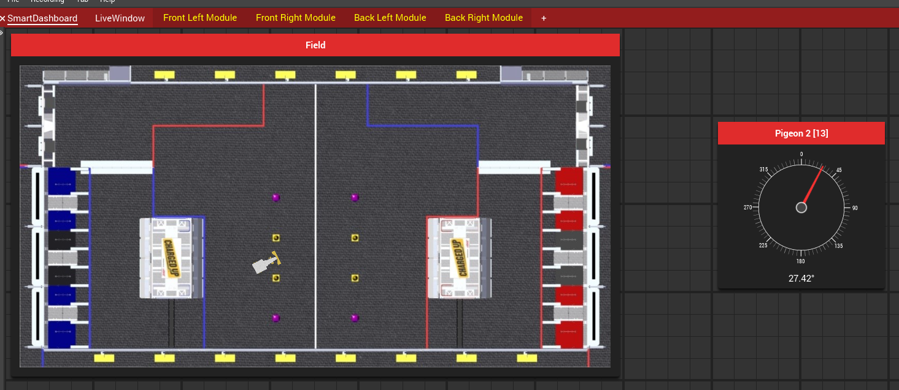
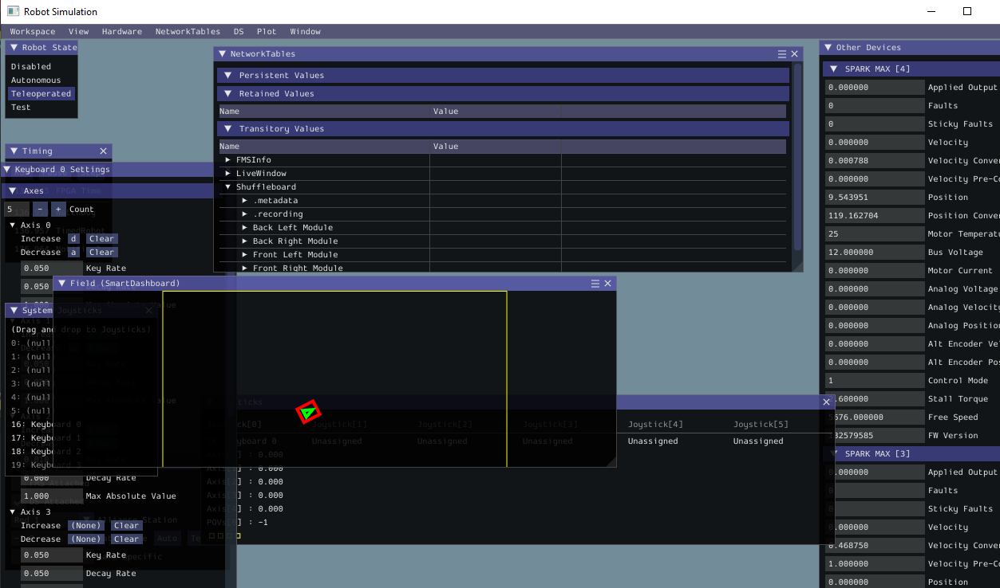

# Yet Another Generic Swerve Library
* In early 2023 `swerve-lib` created by SwerveDriveSpecialties officially became unmaintained after not being updated in 2022.
* This library aims to simplify Swerve Drive implementations while not sacrificing speed or processing power.

# Features
* When a compatible absolute encoder is given it will be used as a remote encoder for the steering motor reducing CAN messages.
* Autogenerated shuffleboard dashboard for each module which can be updated periodically with the verbosity setting.
* The swerve drive is configurable via JSON files, and you can initialize the entire swerve drive with a similar line as the following.
* Simulation support.
```java
SwerveDrive swerveDrive = new SwerveParser(new File(Filesystem.getDeployDirectory(), "swerve")).createSwerveDrive();
```

# Library Information
* The library is located in [swervelib/](./swervelib) with documentation in [docs/](./docs) and example JSON in [deploy](./deploy).

# Check out the [Wiki](https://github.com/BroncBotz3481/YAGSL/wiki)
# Java docs is [here](https://broncbotz3481.github.io/YAGSL/).

# Images


https://user-images.githubusercontent.com/10247070/219801595-b9705a0a-74f1-41c8-b4d9-023ccf9ddbf8.mov
https://user-images.githubusercontent.com/10247070/219801620-c2850078-9b58-4f32-95b4-0f8f6fba23d4.mp4

