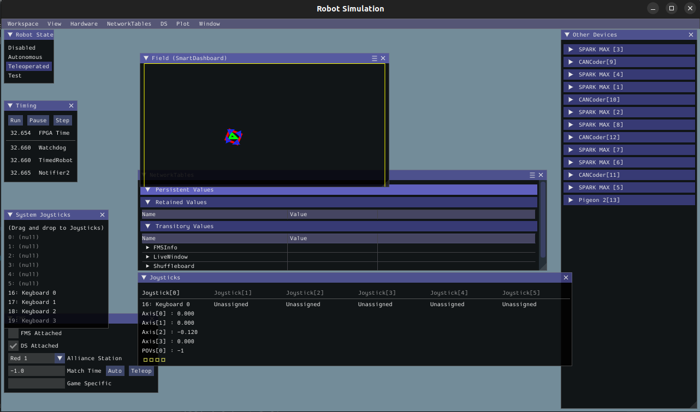

# Yet Another Generic Swerve Library
* In early 2023 `swerve-lib` created by SwerveDriveSpecialties officially became unmaintained after not being updated in 2022.
* This library aims to simplify Swerve Drive implementations while not sacrificing speed or processing power.

# [Features](https://github.com/BroncBotz3481/YAGSL-Example/discussions/29)
* The swerve drive is configurable via JSON files, and you can initialize the entire swerve drive with a similar line as the following.
* Simulation support.
```java
import edu.wpi.first.math.util.Units;

SwerveDrive swerveDrive=new SwerveParser(new File(Filesystem.getDeployDirectory(),"swerve")).createSwerveDrive(Units.feetToMeters(14.5));
```
* The library is located in [swervelib/](./swervelib) with documentation in [docs/](./docs) and example JSON in [deploy](./deploy).
* Support for [NetworkAlerts](https://github.com/Mechanical-Advantage/NetworkAlerts/) for use in Shuffleboard.

# Discussions
* Latest resources and features will be posted on the discusions page [here](https://github.com/BroncBotz3481/YAGSL-Example/discussions).


# Library Information
### Installation
- [ ] Install NavX Library
- [ ] Install Phoenix Library
- [ ] Install REVLib.
- [ ] Install ReduxLib.
- [ ] Install YAGSL (`https://broncbotz3481.github.io/YAGSL-Lib/yagsl/yagsl.json`)  

### [Easy Configuration File Generation](https://broncbotz3481.github.io/YAGSL-Example/)

# Check out the [Wiki](https://github.com/BroncBotz3481/YAGSL/wiki)
# Java docs is [here](https://broncbotz3481.github.io/YAGSL/).

# Images

  

# Falcon Video

https://user-images.githubusercontent.com/10247070/219801595-b9705a0a-74f1-41c8-b4d9-023ccf9ddbf8.mov  

# Neo Video

https://user-images.githubusercontent.com/10247070/219801620-c2850078-9b58-4f32-95b4-0f8f6fba23d4.mp4

# Special Thanks to Team 7900! Trial N' Error
Without the debugging and aid of Team 7900 the project could never be as stable or active as it is.

# Special Thanks to Team 6238! Popcorn Penguins!
Without their hardwork debugging the issue with feedforwards the 2024 release would not have been possible. Thank you!


# Support our developers!
<a href='https://ko-fi.com/yagsl' target='_blank'></a>
